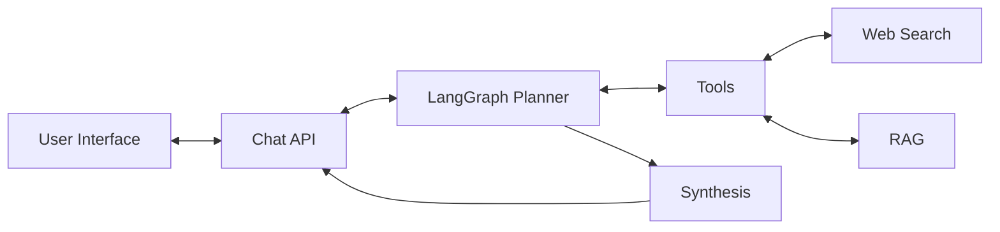

# Agent Tools Project

A simple example of the agent with **LangGraph**, **FastAPI**, **Qdrant**, **SQLite** and **Ollama**.
The example uses **Retrieval-Augmented Generation** and **Web Search** for the tools.

## Table of Contents

1. [Overview](#overview)
2. [Architecture](#architecture)
3. [Prerequisites](#prerequisites)
4. [Running with scripts](#running-with-scripts)
5. [API reference](#api-reference)

## Overview

Agent Tools is the assistant built using LangGraph. It combines tool-augmented reasoning
(web search + RAG), stateful memory (SQLite + Qdrant), and Ollama-backed generation. The backend
exposes both streaming and non-streaming APIs, and the frontend provides a simple chat for the User Interface.

## Architecture

The agent uses a planner to select tools, executes searches or retrieval, then synthesizes an answer
with Ollama. Memory is persisted in SQLite (sessions, turns, summaries, checkpoints), while Qdrant
stores embeddings for RAG and long-term memory recall.

The following is the overall architecture of the Agent Tools Project.



Core components:
- **LangGraph planner**: decides whether to use tools or answer directly.
- **Tools**: web search and RAG retrieval for external context.
- **Synthesis**: Ollama chat model composes the final response.
- **SQLite**: source of truth for sessions, turns, summaries, and checkpoints.
- **Qdrant**: vector index for RAG chunks and durable memory embeddings.

## Prerequisites

- Python 3.12 and UV
- Ollama
- Node.js

## Running with scripts

Backend:

```bash
cd backend
uv run -m app.main
```

Frontend:

```bash
cd frontend
npm install
npm run dev
```

## API reference

| Method | Path | Description | Request | Response |
| --- | --- | --- | --- | --- |
| POST | `/chat` | Non-streaming chat response | JSON | JSON answer + sources |
| POST | `/chat/stream` | Streaming chat response | JSON | SSE events + answer |
| POST | `/rag/documents` | Index documents for RAG | JSON + file upload | JSON response status |