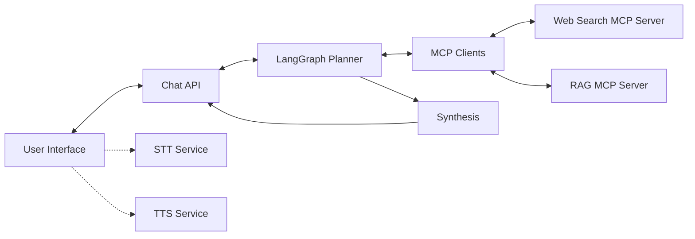

# Agent Tools Project

A simple example of the agent with **LangGraph**, **FastAPI**, **Qdrant**, **SQLite** and **Ollama**.
The example uses **Retrieval-Augmented Generation** and **Web Search** for the tools, with optional **Speech-to-Text** and **Text-to-Speech** services.

## Table of Contents

1. [Overview](#overview)
2. [Architecture](#architecture)
3. [Prerequisites](#prerequisites)
4. [Running with scripts](#running-with-scripts)
5. [API reference](#api-reference)

## Overview

Agent Tools is the assistant built using LangGraph. It combines tool-augmented reasoning
(web search + RAG), stateful memory (SQLite + Qdrant), and Ollama-backed generation. The backend
exposes both streaming and non-streaming APIs, and the frontend provides a simple chat for the User Interface.

## Architecture

The agent uses a planner to select tools, executes searches or retrieval, then synthesizes an answer
with Ollama. Memory is persisted in SQLite (sessions, turns, summaries, checkpoints), while Qdrant
stores embeddings for RAG and long-term memory recall.

The following is the overall architecture of the Agent Tools Project.


```mermaid
flowchart LR
  UI["User Interface"] <--> API["Chat API"]
  API <--> Planner["LangGraph Planner"]
  Planner <--> MCP["MCP Clients"]
  MCP <--> WS["Web Search MCP Server"]
  MCP <--> RAGMCP["RAG MCP Server"]
  Planner --> Synthesis["Synthesis"]
  Synthesis --> API
  UI -.-> STT["STT Service"]
  UI -.-> TTS["TTS Service"]
```

Core components:
- **LangGraph planner**: decides whether to use tools or answer directly.
- **MCP servers**: web search and RAG retrieval exposed via Model Context Protocol.
- **Synthesis**: Ollama chat model composes the final response.
- **SQLite**: source of truth for sessions, turns, summaries, and checkpoints.
- **Qdrant**: vector database for RAG chunks and durable memory embeddings.
- **STT Service** *(optional)*: Dockerized speech-to-text service for voice input.
- **TTS Service** *(optional)*: Dockerized text-to-speech service for spoken responses.

## Prerequisites

- Python 3.12 and UV
- Ollama
- Node.js
- Docker *(only for optional STT/TTS services)*

## Running with scripts

Running (4 terminals):

```bash
# Terminal 1: Web Search MCP server (port 8001)
cd mcp-servers/web-search && uv run -m web_search_mcp

# Terminal 2: RAG MCP server (port 8002)
cd mcp-servers/rag && uv run -m rag_mcp

# Terminal 3: Backend API (port 8000)
cd backend && uv run -m app.main

# Terminal 4: Frontend (port 3000)
cd frontend && npm run dev
```

**Optional** — Speech services (Terminal 5):

```bash
# Terminal 5: STT (port 8003) + TTS (port 8004)
cd services && docker compose up
```

To enable speech features in the frontend, set these environment variables before starting the frontend:

```bash
NEXT_PUBLIC_STT_ENABLED=true
NEXT_PUBLIC_TTS_ENABLED=true
```

## API reference

| Method | Path | Description | Request | Response |
| --- | --- | --- | --- | --- |
| POST | `/chat` | Non-streaming chat response | JSON | JSON answer + sources |
| POST | `/chat/stream` | Streaming chat response | JSON | SSE events + answer |
| POST | `/rag/documents` | Index documents for RAG | JSON + file upload | JSON response status |
| POST | `/transcribe` | Speech-to-text *(STT service, port 8003)* | Audio file | JSON transcription |
| POST | `/synthesize` | Text-to-speech *(TTS service, port 8004)* | JSON text | Audio file |